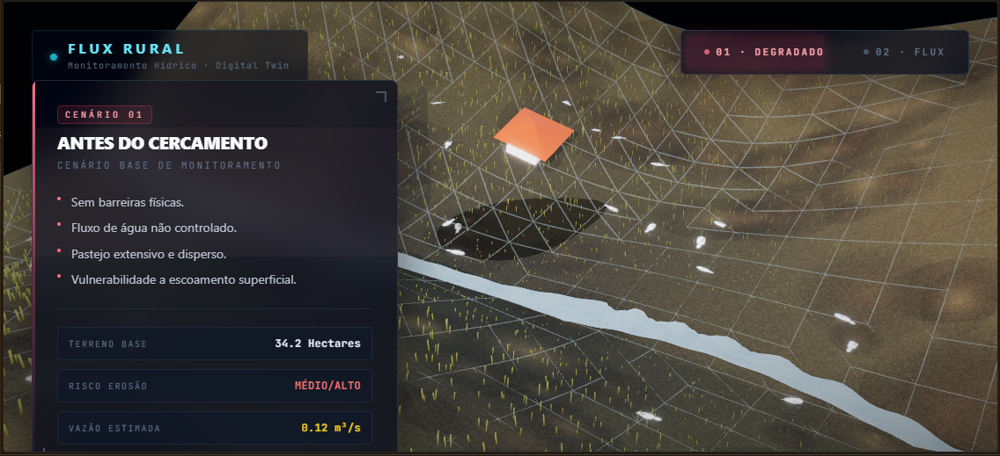

# 🌐 Flux Rural Intelligence
### *Digital Twin para Gestão de Riscos Hídricos e Proteção de Nascentes*

> **Nota:** Este projeto é uma solução de Engenharia Ambiental e Computacional focada em monitoramento de fluxo hídrico em tempo real.

---

## 🏗️ Visão Geral
O **Flux Rural Intelligence** combina modelagem 3D, cálculos de CFD (*Computational Fluid Dynamics*) e geoprocessamento para simular o comportamento hídrico em microbacias. O objetivo é fornecer uma ferramenta de suporte à decisão para produtores rurais e órgãos ambientais.

---

## 🛠️ Stack Tecnológico (Core)

| Categoria | Tecnologia | Prioridade/Finalidade |
| :--- | :--- | :--- |
| **Frontend** | React.js + Tailwind | Interface rápida e responsiva |
| **Renderização 3D** | Three.js / Fiber | Simulação espacial e visualização |
| **Geoprocessamento** | Python + QGIS | Processamento de dados de relevo |
| **Simulação** | CFD & Flux Logic | Cálculo de volume e dispersão hídrica |
| **Ambiente** | Node.js | Gerenciamento de pacotes |

---

## 📊 Resultados Técnicos
Abaixo, a comparação visual da eficácia das estratégias de preservação implementadas no sistema:

| Cenário | Estado da Nascente | Impacto Hídrico Estimado |
| :--- | :--- | :--- |
| **Antes** | Degradado (Desprotegido) | Alta erosão / Baixa retenção |
| **Depois** | Recuperado (Flux-Intelligence) | Fluxo estável / Recarga do aquífero |

---

## 📸 Registros de Simulação

### Cenário de Implementação (Antes vs Depois)




---

## ⚙️ Como executar
```bash
# 1. Clone o repositório
git clone [https://github.com/eniocarlossoilook34-netizen/Projeto-ExpoAgro.git](https://github.com/eniocarlossoilook34-netizen/Projeto-ExpoAgro.git)

# 2. Instale as dependências
npm install

# 3. Inicie o ambiente de desenvolvimento
npm run dev


🎓 Autor
Enio Carlos Silva Oliveira

Graduando em Engenharia Civil e Ambiental - UNIVALE


### Como aplicar agora:
1. Abra o arquivo `README.md` no seu VS Code.
2. **Apague tudo** o que tem lá dentro.
3. Cole exatamente esse código acima.
4. Salve (`Ctrl + S`).
5. Rode no terminal para subir essa atualização:
   ```bash
   git add .
   git commit -m "Melhorando estrutura do README"
   git push origin main
