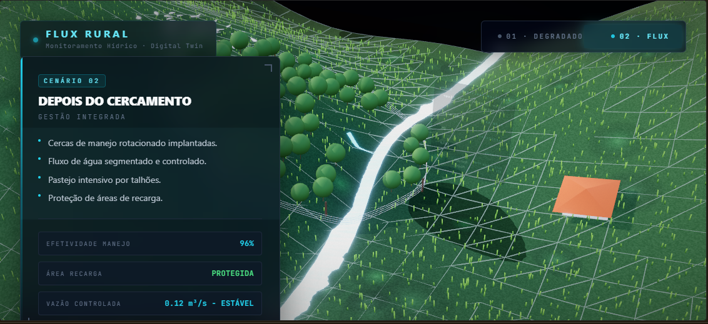

Flux Rural Intelligence
Gêmeo Digital para Monitoramento de Nascentes e Gestão de Riscos Hídricos

🎯 Sobre o Projeto
O Flux Rural Intelligence é uma plataforma de monitoramento e simulação em tempo real, projetada para auxiliar na gestão de recursos hídricos e na proteção de nascentes. Utilizando tecnologias de Digital Twin e WebGL, o projeto permite que profissionais de engenharia e proprietários rurais visualizem o impacto de ações de preservação, como o cercamento de nascentes e o manejo de solo, com alta fidelidade geográfica.

🛠 Tecnologias Utilizadas
Este projeto foi desenvolvido com uma arquitetura moderna de alto desempenho:

Frontend: React.js + Tailwind CSS (Interface Kiosk-Ready).

Renderização 3D: Three.js / React-Three-Fiber (Simulação de terreno e erosão procedural).

Análise Geográfica: Integração com dados GIS e processamento de fluxo hídrico (FastAPI/React).

Versionamento: GitHub (Versionamento contínuo para portfólio profissional).

🚀 Funcionalidades Principais
Modos de Cenário: Alternância fluida entre terreno "Degradado" e ambiente de "Proteção (Flux)".

Simulação de Fluxo: Jato de água procedural com cálculo de perda de carga e dispersão.

Geologia Procedural: Sistema de rochas instanciadas e vegetação (Low-Poly Pro) com distribuição natural.

Modo Demo (ExpoAgro): Sistema Kiosk com câmera tour automática e controle remoto via celular (QR Code).

📸 Galeria de Visualização

Figura 1: Sistema de proteção de nascente com vegetação nativa.

Figura 2: Detalhe do terreno com erosão procedural e casa colonial.

👨‍💻 Desenvolvedor
Enio Carlos Silva Oliveira

Estudante de Engenharia Civil e Ambiental (UNIVALE)
